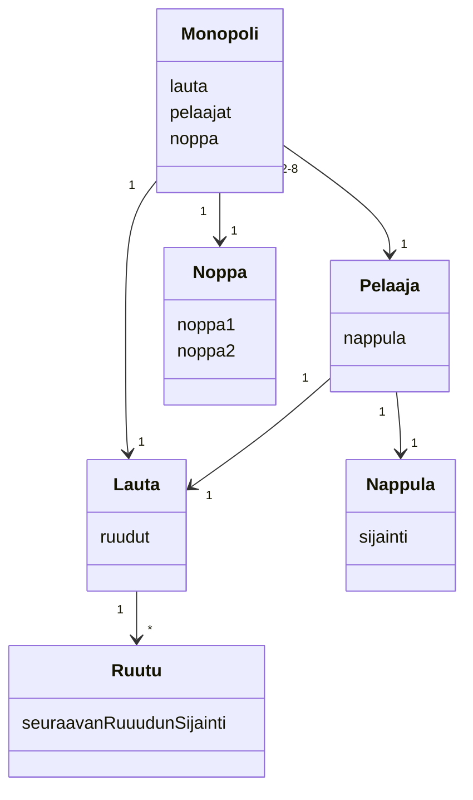

```mermaid
classDiagram
    Monopoli "1" --> "1" Lauta
    Monopoli "2-8" --> "1" Pelaaja
    Monopoli "1" --> "1" Noppa
    Lauta "1" --> "*" Ruutu
    Pelaaja "1" --> "1" Lauta
    Pelaaja "1" --> "1" Nappula
    class Monopoli{
	lauta
	pelaajat
	noppa
    }
    class Lauta{
	ruudut
    }
    class Ruutu{
	seuraavanRuuudunSijainti
    }
    class Pelaaja{
	nappula
    }
    class Nappula{
	sijainti
    }
    class Noppa{
	noppa1
	noppa2
    }
```
